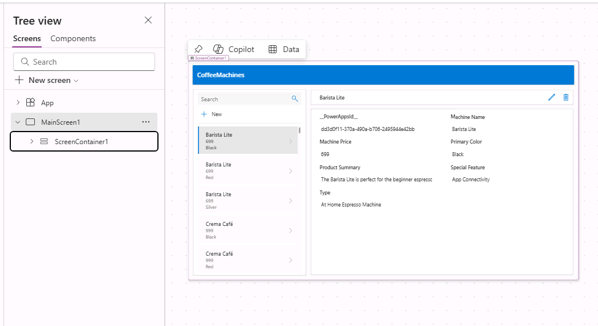

---
lab:
  title: 'Laboratório 1: Criar um aplicativo de tela com base em dados'
  module: 'Module 1: Get started with Power Apps canvas apps'
---

# Laboratório de Prática 1 – Criar um aplicativo de tela com base em dados

Neste laboratório, você criará o projeto de um aplicativo de tela de uma fonte de dados existente e o compilará.

## O que você aprenderá

- Como criar aplicativos de tela do Power Apps a partir de dados e com o CoPilot
- Como se conectar ao Excel usando o OneDrive for Business como fonte de dados

## Macroetapas do laboratório

- Criar um aplicativo de tela a partir de dados
- Testar o aplicativo
- Criar um aplicativo de tela com o CoPilot
  
## Pré-requisitos

- Precisa ter concluído o **Laboratório 0: Validar o ambiente de laboratório**

## Etapas detalhadas

## Exercício 1 – Obter os dados

### Tarefa 1.1 – Baixar a planilha do Excel

1. Navegue até [CoffeeMachineData.xlsx](https://github.com/MicrosoftLearning/PL-7001-Create-and-manage-canvas-apps-with-Power-Apps/blob/master/Allfiles/Labs/CoffeeMachineData.xlsx).

1. Selecione o botão de arquivo **Raw** para baixar a pasta de trabalho do Excel.

    

### Tarefa 1.2 Carregar no OneDrive for Business

1. No [portal do criador do Power Apps](https://make.powerapps.com), selecione o **Inicializador de aplicativos** no canto superior esquerdo da janela do navegador e selecione o **OneDrive**.

    

1. Se for apresentada uma janela pop-up, selecione **Seu OneDrive está pronto**.

1. Escolha **+ Criar ou carregar** e selecione **Upload de arquivos**.

    

1. Navegue até a pasta **Downloads**, selecione o arquivo **CoffeeMachineData.xlsx** e clique em **Abrir**.

1. Selecione **Meus arquivos** e verifique se CoffeeMachineData.xlsx foi carregado.

## Exercício 2 — Criar um aplicativo de tela a partir de dados

### Tarefa 2.1 – Criar o aplicativo

1. Navegue até o portal do Power Apps Maker <https://make.powerapps.com>.

1. Certifique-se de que você esteja no ambiente **Dev One**.

1. Selecione a guia **+ Criar** no menu esquerdo.

1. Selecione o bloco **Iniciar com dados** em **Criar seus aplicativos**.

    

1. Selecione o bloco **Conectar dados externos** em **Outras maneiras de começar**.

    

1. Selecione o bloco **Do Excel** em **Escolher um conjunto de dados para iniciar**.

    

1. Uma conexão do **Excel Online (Business)** será criada automaticamente após um pequeno atraso.

1. Expanda **OneDrive for Business** em **Selecionar a tabela**.

1. Expanda **OneDrive**.

1. Expanda o arquivo do Excel **CoffeeMachineData.xlsx**.

1. Selecione a tabela **CoffeeMachines**.

    

1. Selecione **Criar aplicativo**.

1. Se a caixa de diálogo pop-up **Bem-vindo(a) ao Power Apps Studio** for exibida, selecione **Não mostrar isso novamente** e **Ignorar**.

1. Aguarde até que o aplicativo seja criado.

    

1. Selecione **Salvar** no canto superior direito do Power Apps Studio, insira `Coffee Machines App` e selecione **Salvar**.

### Tarefa 2.2 – Testar o aplicativo

1. Clique no ícone de **pré-visualização do aplicativo (F5)** no canto superior direito do Power Apps Studio.

1. Selecione qualquer computador na galeria. Isso exibirá informações da máquina no formulário.

1. Selecione o ícone **Editar** no canto superior direito do aplicativo.

1. Altere o **Preço da máquina** e clique no ícone **Tique** no canto superior direito do aplicativo.

1. Clique no ícone **+ Novo** no canto superior esquerdo do aplicativo.

1. Insira `abcde` em ID da máquina.

1. Insira `Demo Machine` em **Nome do computador**.

1. Insira `999` em **Preço do computador**.

1. Clique no ícone **Tique** no canto superior direito do aplicativo.

1. Selecione **X** no canto superior direito para interromper a pré-visualização.

1. Se for exibida a caixa de diálogo pop-up **Você sabia? **, selecione **Não mostrar isso novamente** e selecione **Ok**.

1. Selecione o botão **<- Voltar** no canto superior esquerdo da barra de comandos e escolha **Sair** para sair do aplicativo.

## Exercício 3 – Criar um aplicativo de tela com o Copilot

### Tarefa 3.1 – Criar o aplicativo

1. Navegue até o portal do Power Apps Maker `https://make.powerapps.com`

1. Verifique se você está no ambiente **Dev One**.

1. Selecione a guia **+ Criar** no menu esquerdo.

1. Selecione o bloco **Iniciar com o Copilot** em **Criar seus aplicativos**.

1. Em **Introdução ao Copilot**, digite `Assign coffee repairs to technicians per customer request`.

    

1. Clique no ícone **Opções de tabela** e selecione **Uma tabela**.

    

1. Selecione **Gerar**.

    O Copilot começará a criar uma estrutura de tabela para dar suporte ao aplicativo.

    > **IMPORTANTE:** Ao usar a IA gerativa, nem sempre você obterá os mesmos resultados exatos. É possível que sua tabela não corresponda exatamente à tabela criada para outro aluno.

1. Selecione os **Comandos (...)** ao lado da tabela e selecione **Exibir dados**.

    

1. Examinar a tabela

    

1. Quando estiver contente com a tabela, clique no botão **Salvar e abrir aplicativo**.

1. Se necessário, na tela **Concluiu o trabalho?**, clique em **Não perguntar novamente** e clique no botão **Salvar e abrir aplicativo**.

1. Aguarde até que o aplicativo seja criado.

    

1. Selecione **Salvar** no canto superior direito do Power Apps Studio, insira `Coffee Machine Repairs App` e selecione **Salvar**.

1. Selecione o botão **<- Voltar** no canto superior esquerdo da barra de comandos e selecione **Sair** para sair do aplicativo.

1. Selecione a guia **Aplicativos** no menu esquerdo do portal do criador do Power Apps.
