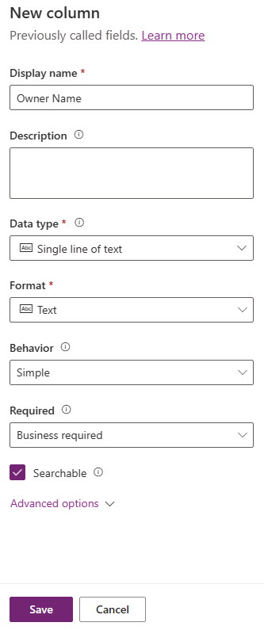

---
lab:
  title: 'Laboratório 2: Modelo de dados'
  module: 'Module 2: Get started with Microsoft Dataverse'
---

# Laboratório de prática 2 – Modelo de dados

Neste laboratório, você criará tabelas e colunas do Dataverse.

## O que você aprenderá

- Como criar tabelas e colunas no Microsoft Dataverse
- Como criar uma relação com uma coluna de pesquisa

## Macroetapas do laboratório

- Criar uma tabela personalizada
- Adicionar colunas à tabela
- Criar relação com o usando uma coluna de pesquisa
  
## Pré-requisitos

- Precisa ter concluído o **Laboratório 0: Validar o ambiente de laboratório**

## Etapas detalhadas

## Exercício 1 – Criar tabelas personalizadas

### Tarefa 1.1 – Criar a tabela Solicitação de reserva

1. Navegue até o portal do Power Apps Maker `https://make.powerapps.com`

1. Verifique se você está no ambiente **Dev One**.

1. No painel de navegação esquerdo, selecione **Tabelas**.

1. Selecione **+ Nova tabela** e selecione **Adicionar colunas e dados**.

    

1. Selecione o ícone de lápis **Editar propriedades da tabela** ao lado de **Nova tabela**.

    

1. Para **Nome de exibição**, insira `Booking Request`.

1. Selecione **Salvar**.

### Tarefa 1.2 – Coluna primária

1. Selecione o cursor suspenso ao lado de **Nova coluna** e selecione **Editar coluna**.

    

1. Para **Nome de exibição**, insira `Pet Name`.

1. Selecione **Atualizar**.

1. Selecione **Criar**.

### Tarefa 1.3 – Adicionar colunas

1. No painel **Colunas e dados de Solicitação de reserva**, selecione **+** para adicionar uma nova coluna.

    

1. No painel **Nova coluna**, insira ou selecione os seguintes valores:

   1. Nome de exibição`Owner Name`
   1. Tipo de dados: **Linha única de texto**
   1. Obrigatório: **Empresa necessária**

    

1. Selecione **Salvar**.

1. No painel **Colunas e dados de Solicitação de reserva**, selecione **+** para adicionar uma nova coluna.

1. No painel **Nova coluna**, insira ou selecione os seguintes valores:

   1. Nome de exibição`Owner Email`
   1. Tipo de dados: **Linha única de texto**
   1. Formato: **Email**
   1. Obrigatório: **Empresa necessária**

1. Selecione **Salvar**.

1. No painel **Colunas e dados de Solicitação de reserva**, selecione **+** e, no painel **Nova coluna**, insira ou selecione os seguintes valores:

   1. Nome de exibição`Start Date`
   1. Tipo de dados: **Data e hora**
   1. Obrigatório: **Empresa necessária**

1. Selecione **Salvar**.

1. No painel **Colunas e dados de Solicitação de reserva**, selecione **+** e, no painel **Nova coluna**, insira ou selecione os seguintes valores:

   1. Nome de exibição`End Date`
   1. Tipo de dados: **Data e hora**
   1. Obrigatório: **Opcional**

1. Selecione **Salvar**.

1. No painel **Colunas e dados de Solicitação de reserva**, selecione **+** e, no painel **Nova coluna**, insira ou selecione os seguintes valores:

   1. Nome de exibição`Cost`
   1. Tipo de dados: **Moeda**
   1. Obrigatório: **Opcional**

1. Selecione **Salvar**.

1. No painel **Colunas e dados de Solicitação de reserva**, selecione **+** e, no painel **Nova coluna**, insira ou selecione os seguintes valores:

   1. Nome de exibição`Notes`
   1. Tipo de dados: **Várias linhas de texto**
   1. Formato: **Text**
   1. Obrigatório: **Opcional**

1. Selecione **Salvar**.

### Tarefa 1.4 – Adicionar coluna de escolha

1. No painel **Colunas e dados de Solicitação de reserva**, selecione **+** e, no painel **Nova coluna**, insira ou selecione os seguintes valores:

   1. Nome de exibição`Decision`
   1. Tipo de dados: **Escolha**
   1. Obrigatório: **Opcional**

1. Selecione **Não** para **Sincronização com escolha global?**

1. Insira `Undecided` para **Rótulo** e insira `1` para **Valor**.

1. Selecione **+ Nova escolha** e insira `Accepted` para **Rótulo** e insira `2` para **Valor**.

1. Selecione **+ Nova opção** e insira `Declined` para **Rótulo** e insira `3` para **Valor**.

1. Selecione **Não decidido** para **Escolha padrão**.

    

1. Selecione **Salvar**.

## Exercício 2 – Criar relação

### Tarefa 2.1 – Criar uma coluna de pesquisa

1. Navegue até o portal do Power Apps Maker `https://make.powerapps.com`

1. Verifique se você está no ambiente **Dev One**.

1. No painel de navegação esquerdo, selecione **Tabelas**.

1. Selecione **Solicitação de Reserva**.

1. No painel **Colunas e dados de Solicitação de reserva**, selecione **+** e, no painel **Nova coluna**, insira ou selecione os seguintes valores:

   1. Nome de exibição`Account`
   1. Tipo de dados: **Pesquisa**
   1. Obrigatório: **Opcional**
   1. Tabela relacionada: **Conta**

    

1. Selecione **Salvar**.

## Exercício 3 – Dados

### Tarefa 3.1: adicionar registros de solicitação de reserva

1. Navegue até o portal do Power Apps Maker <https://make.powerapps.com>.

1. Certifique-se de que você esteja no ambiente **Dev One**.

1. No painel de navegação esquerdo, selecione **Tabelas**.

1. Selecione **Solicitação de Reserva**.

1. No painel **Colunas e dados de Solicitação de Reserva**, selecione o cursor suspenso ao lado de **Editar** e selecione **Editar na nova guia**.

1. Insira ou selecione os valores a seguir:

   1. Nome do Animal de Estimação: `Fido`
   1. Nome do proprietário: `MOD Administrator`
   1. Email do Tutor: Usar seu email de locatário
   1. Data de início: **Amanhã**
   1. Data de término: **Escolher uma data na próxima semana**
   1. Custo: `1,000`
   1. Decisão: **Aceita**

1. Selecione **Inserir linha abaixo** e insira ou selecione os seguintes valores:

   1. Nome do Animal de Estimação: `Tom`
   1. Nome do proprietário: `MOD Administrator`
   1. Email do Tutor: Usar seu email de locatário
   1. Data de início: **Escolher uma data no próximo mês**
   1. Data de término: **Escolher uma data após a data de início**
   1. Custo: `1,500`
   1. Decisão: **Não foi decidida**

1. Selecione **Inserir linha abaixo** e insira ou selecione os seguintes valores:

   1. Nome do Animal de Estimação: `Jim`
   1. Nome do proprietário: `MOD Administrator`
   1. Email do Tutor: Usar seu email de locatário
   1. Data de início: **Escolher uma data futura no mês atual**
   1. Data de término: **Escolher uma data após a data de início**
   1. Custo: `250`
   1. Decisão: **Recusada**

1. Feche a guia editar dados.

