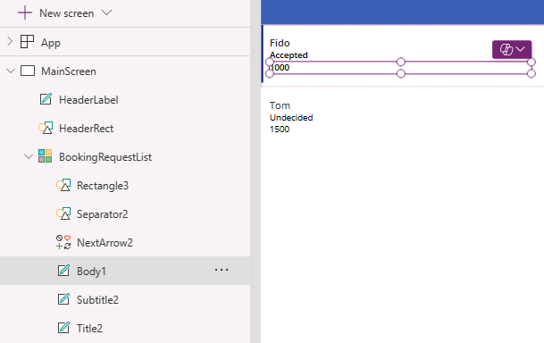

---
lab:
  title: 'Laboratório 3: Criar um aplicativo de tela'
  module: 'Module 3: Customize a canvas app in Power Apps'
---

# Laboratório de prática 3 – Criar um aplicativo de tela

Neste laboratório, você projetará e criará um aplicativo de tela em branco, adicionará uma fonte de dados e uma galeria.

## O que você aprenderá

- Como criar um aplicativo de tela com uma galeria vinculada a uma fonte de dados
- Como formatar campos com fórmulas do Power Fx

## Macroetapas do laboratório

- Criar um aplicativo de tela em branco
- Adicionar uma fonte de dados ao aplicativo
- Adicionar uma galeria ao aplicativo
- Configurar os campos na galeria
  
## Pré-requisitos

- É necessário ter concluído **Laboratório 2: Modelo de dados**

## Etapas detalhadas

## Exercício 1 – Criar um aplicativo de tela

### Tarefa 1.1 – Criar o aplicativo

1. Navegue até o portal do Power Apps Maker `https://make.powerapps.com`

1. Verifique se você está no ambiente **Dev One**.

1. Selecione a guia **+ Criar** no menu de navegação à esquerda.

1. Selecione o bloco **Começar com uma tela em branco** em **Criar seus aplicativos**.

1. Selecione **Tamanho da tabela**.

1. Aguarde a criação do aplicativo em branco.

1. Selecione **Salvar** no canto superior direito do Power Apps Studio, insira `Booking Request app` e selecione **Salvar**.

### Tarefa 1.2 – Adicionar fonte de dados

1. No menu de criação de aplicativo, selecione **Dados**.

    

1. Selecione o cursor suspenso ao lado de **Adicionar dados** e insira `Booking` em **Pesquisa**.

    

1. Selecione a tabela **Solicitações de reserva** do Microsoft Dataverse.

### Tarefa 1.3 – Configurar a tela principal

1. No menu de criação do aplicativo, selecione o **Modo de exibição de árvore**.

1. Escolha **Tela1** no modo de exibição de árvore, selecione as reticências (**...**) e depois **Renomear**.

1. Digite `MainScreen`.

1. No menu de criação do aplicativo, selecione **Inserir (+)**.

1. Selecione **Retângulo**.

1. Arraste o retângulo para o canto superior esquerdo da tela.

1. No menu de criação do aplicativo, selecione o **Modo de exibição de árvore**.

1. Renomeie o retângulo como `HeaderRect`.

1. Defina as propriedades do retângulo na barra de fórmulas da seguinte maneira:

   1. X=`0`
   1. Y=`0`
   1. Altura=`80`
   1. Largura=`Parent.Width`

1. No menu de criação do aplicativo, selecione **Inserir (+)**.

1. Selecione **Rótulo de texto**.

1. Arraste o rótulo para o canto superior esquerdo da tela.

1. No menu de criação do aplicativo, selecione o **Modo de exibição de árvore**.

1. Renomeie o rótulo como `HeaderLabel`.

1. Defina as propriedades do rótulo na barra de fórmulas da seguinte maneira:

   1. X=`0`
   1. Y=`0`
   1. Altura=`80`
   1. Largura=`Parent.Width`
   1. Alinhamento=`Align.Center`
   1. Tamanho=`24`
   1. Texto=`"Booking Request"`
   1. Cor=`Color.White`

    

1. Selecione **Salvar** no canto superior direito do Power Apps Studio.

### Tarefa 1.4 – Adicionar uma galeria

1. No menu de criação do aplicativo, selecione **Inserir (+)**.

1. Selecione **Galeria vertical**.

    

1. Selecione **Solicitações de Reserva** como a fonte de dados.

    

1. **Na guia Propriedades**, em **Layout**, selecione **Título, subtítulo e corpo**.

1. Selecione **7 selecionados** ao lado de **Campos**.

1. Selecione **Custo** para **Corpo1**.

   > **OBSERVAÇÃO:** os nomes de campo podem ser mostrados como nomes de esquema com um prefixo não relacionado ao nome de exibição.

1. Selecione **Decisão** para **Subtítulo2**.

1. Selecione **Nome do animal de estimação** para **Título2**.

    

1. Feche o painel **Dados**.

1. No menu de criação do aplicativo, selecione o **Modo de exibição de árvore**.

1. Renomeie a galeria como `BookingRequestList`.

1. Se uma caixa de diálogo pop-up de sugestões for exibida, selecione **Cancelar**.

1. Defina as propriedades da galeria na barra de fórmulas da seguinte maneira:

   1. X=`0`
   1. Y=`80`
   1. Altura=`575`
   1. Largura=`250`

### Tarefa 1.5 – Formatar o campo de moeda

1. No menu de criação do aplicativo, selecione o **Modo de exibição de árvore**.

1. Expanda a galeria **BookingRequestList**.

1. Selecione **Body1**.

    

1. Na barra de fórmulas, defina a propriedade **Texto** para a seguinte fórmula:

    ```powerappsfl
    Text(Value(ThisItem.Cost), "$#,##0.00")
    ```

1. Selecione **Salvar** no canto superior direito do Power Apps Studio.

1. Selecione o botão **<- Voltar** no canto superior esquerdo da barra de comandos e selecione **Sair** para sair do aplicativo.
