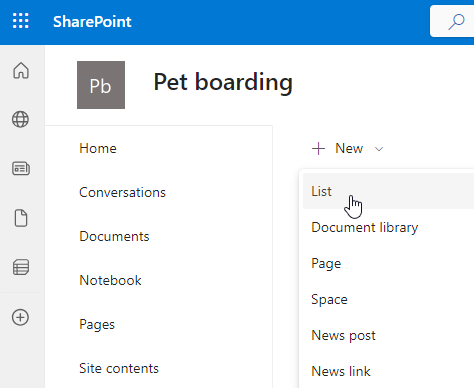
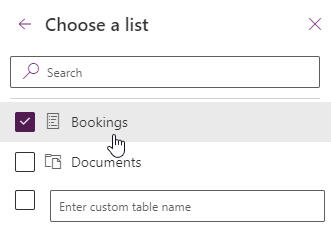

---
lab:
  title: 'Laboratório 5: Dados externos'
  module: 'Module 5: Work with external data in a Power Apps canvas app'
---

# Laboratório prático 5 – Dados externos

Neste laboratório, você adicionará uma fonte de dados externa.

## O que você aprenderá

- Como adicionar uma lista do SharePoint ao seu aplicativo de tela
- Como usar coleções
- Como usar o Patch
- Como usar o conector Office365Users

## Macroetapas do laboratório

- Criar uma lista do SharePoint para reservas
- Adicionar a lista do SharePoint como uma galeria
- Armazenar registros selecionados de uma galeria
- Use o Patch para definir a decisão de uma solicitação de reserva
- Use o conector Office365User para exibir os detalhes do usuário.
  
## Pré-requisitos

- Precisa ter concluído o **Laboratório 4: Criar a interface do usuário**

## Etapas detalhadas

## Exercício 1 – Criar uma lista do SharePoint

### Tarefa 1.1 Criar um site do SharePoint

1. No [portal dos Criadores de Power Apps](https://make.powerapps.com), selecione o **Inicializador de aplicativos** no canto superior esquerdo da janela do navegador e escolha **SharePoint**.

1. Se a caixa de diálogo pop-up **Bem-vindo à Página Inicial do SharePoint** for exibida, selecione **X** para fechá-la.

1. No SharePoint, selecione **+ Criar site**.

1. Escolha **Site de equipe**, selecione o modelo **Equipe padrão** e escolha **Usar modelo**.

1. Insira `Pet boarding` em **Nome do site** e selecione **Avançar**.

1. Selecione **Criar site**.

1. Selecione **Concluir**.

1. Se a caixa de diálogo pop-up **Iniciar a criação do site** for exibida, feche-a.

### Tarefa 1.2 Criar uma lista do SharePoint

1. No site do SharePoint, selecione **+ Novo** e escolha **Lista**.

    

1. Selecione **Lista em branco**

1. Insira `Bookings` em **Nome** e escolha **Criar**.

1. Selecione **+ Adicionar coluna**, escolha **Texto** e selecione **Avançar**.

1. No painel **Criar uma coluna**, insira ou selecione os seguintes valores:

   1. Nome: `Pet Name`
   1. Tipo de dados: **Linha única de texto**

1. Selecione **Salvar**.

1. Selecione **+ Adicionar coluna**, escolha **Texto** e selecione **Avançar**.

1. No painel **Criar uma coluna**, insira ou selecione os seguintes valores:

   1. Nome: `Owner Name`
   1. Tipo de dados: **Linha única de texto**

1. Selecione **Salvar**.

1. Selecione **+ Adicionar coluna**, escolha **Data e hora** e selecione **Avançar**.

1. No painel **Criar uma coluna**, insira ou selecione os seguintes valores:

   1. Nome: `Start Date`
   1. Tipo de dados: **Data e hora**

1. Selecione **Salvar**.

1. Selecione **+ Adicionar coluna**, escolha **Data e hora** e selecione **Avançar**.

1. No painel **Criar uma coluna**, insira ou selecione os seguintes valores:

   1. Nome: `End Date`
   1. Tipo de dados: **Data e hora**

1. Selecione **Salvar**.

1. Copie a primeira parte da URL do site do SharePoint, por exemplo, `https://m365x99999999.sharepoint.com/sites/Petboarding/`

## Exercício 2 – Adicionar lista do SharePoint ao aplicativo de tela

### Tarefa 2.1 — Editar o aplicativo

1. Navegue até o portal do Power Apps Maker <https://make.powerapps.com>.

1. Certifique-se de que você esteja no ambiente **Dev One**.

1. Selecione a guia **Aplicativos** no menu esquerdo.

1. Escolha o **aplicativo Solicitação de Reserva**, selecione os Comandos (**…**) e escolha **Editar > Editar em uma nova guia**.

### Tarefa 2.2 – Adicionar o SharePoint como uma fonte de dados

1. No menu de criação de aplicativo, selecione **Dados**.

1. Selecione o cursor suspenso ao lado de **Adicionar dados** e insira `SharePoint` em **Pesquisa**.

    

1. Selecione **SharePoint**.

1. Selecione **Conectar diretamente (serviços de nuvem)** e selecione **Conectar**.

1. Insira a URL do site do SharePoint criado anteriormente neste laboratório

    

1. Selecione **Conectar**.

1. Selecione **Reservas**.

    

1. Selecione **Conectar**.

### Tarefa 2.3 – Adicionar galeria para lista do SharePoint

1. No menu de criação do aplicativo, selecione **Inserir (+)**.

1. Selecione **Galeria vertical**.

1. Selecione **Reservas** para fonte de dados.

1. Selecione **Título e subtítulo** para **Layout**.

1. Selecione **6 selecionados** ao lado de **Campos**

1. Selecione **Nome do animal de estimação** para **Título**.

1. Selecione **Data de Início** para **Subtítulo**.

1. Feche o painel Dados.

1. No menu de criação do aplicativo, selecione o **Modo de exibição de árvore**.

1. Renomeie a galeria como `BookingList`.

1. Defina as propriedades da galeria na barra de fórmulas da seguinte maneira:

   1. X=`1000`
   1. Y=`80`
   1. Altura=`575`
   1. Largura=`250`

## Exercício 3 – Coleções

### Tarefa 3.1 Criar Coleção

1. No menu de criação do aplicativo, selecione o **Modo de exibição de árvore**.

1. Expanda **BookingRequestList**.

1. Selecione **NextArrow**.

1. Defina a propriedade **OnSelect** de NextArrow na barra de fórmulas como:

    ```powerappsfl
    Collect(colRequests, ThisItem)
    ```

1. No menu de criação do aplicativo, selecione o **Modo de exibição de árvore**.

1. Selecione o objeto **App**.

1. Defina a propriedade **OnStart** na barra de fórmulas como:

    ```powerappsfl
    Clear(colRequests)
    ```

## Exercício 4 – Patch

### Tarefa 4.1 Recusar pedido de reserva

1. No menu de criação do aplicativo, selecione o **Modo de exibição de árvore**.

1. Selecione **BookingRequestList**.

1. Selecione o ícone de **lápis** no canto superior esquerdo do controle da galeria.

    

1. No menu de criação do aplicativo, selecione **Inserir (+)**.

1. Expanda **Ícones**.

1. Escolha **Bloqueado**. O ícone será adicionado a cada linha na galeria.

    

1. Defina as propriedades do ícone na barra de fórmulas da seguinte maneira:

   1. X=`150`
   1. Y=`40`
   1. Altura=`30`
   1. Largura=`30`

1. No menu de criação do aplicativo, selecione o **Modo de exibição de árvore**.

1. Renomeie o ícone como `DeclineIcon`.

1. Defina a propriedade **OnSelect** de **DeclineIcon** na barra de fórmulas como:

    ```powerappsfl
    Patch('Booking Requests', ThisItem, {Decision: 'Decision (Booking Requests)'.Declined})
    ```

## Exercício 5 – Usuários do Office 365

### Tarefa 5.1 Adicionar usuários do Office 365 como uma fonte de dados

1. No menu de criação de aplicativo, selecione **Dados**.

1. Selecione o cursor suspenso ao lado de **Adicionar dados** e insira `Office 365` em **Pesquisa**.

1. Selecione **Usuários do Office 365**.

1. Selecione **Conectar**.

### Tarefa 5.2 Exibir o país do usuário

1. Clique fora da galeria na tela em branco.

1. No menu de criação do aplicativo, selecione **Inserir (+)**.

1. Selecione **Rótulo de texto**.

1. Arraste o rótulo para o canto superior direito da tela ao lado do UserLabel.

1. No menu de criação do aplicativo, selecione o **Modo de exibição de árvore**.

1. Renomeie o rótulo como `UserDetailsLabel`.

1. Defina a propriedade **Texto** de **UserDetailsLabel** na barra de fórmulas como:

    ```powerappsfl
    Office365Users.MyProfile().Country
    ```

1. Selecione **Salvar** no canto superior direito do Power Apps Studio.

1. Selecione o botão **<- Voltar** no canto superior esquerdo da barra de comandos e selecione **Sair** para sair do aplicativo.
