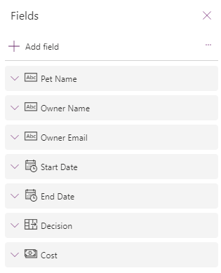

---
lab:
  title: 'Laboratório 6: Formulários'
  module: 'Module 6: Write data in a Power Apps canvas app'
---

# Laboratório prático 6 — Formulários

Neste laboratório, você usará formulários para criar e editar registros em uma fonte de dados.

## O que você aprenderá

- Como adicionar telas
- Como navegar entre telas
- Como usar um formulário para criar um registro em uma fonte de dados
- Como usar um formulário para editar um registro em uma fonte de dados
- Como excluir um registro de uma fonte de dados
- Como vincular um formulário a uma galeria

## Macroetapas do laboratório

- Criar telas
- Navegar para uma tela quando um registro é selecionado em uma galeria
- Navegar entre telas
- Exibir um registro com um formulário
- Excluir um registro
- Editar um registro com um formulário
- Criar um registro com um formulário
  
## Pré-requisitos

- Precisa ter concluído o **Laboratório 5: Dados externos**

## Etapas detalhadas

## Exercício 1 — Adicionar telas e a navegação

### Tarefa 1.1 — Editar o aplicativo

1. Navegue até o portal do Power Apps Maker `https://make.powerapps.com`

1. Verifique se você está no ambiente **Dev One**.

1. Selecione a guia **Aplicativos** no menu de navegação à esquerda.

1. Escolha o **aplicativo Solicitação de Reserva**, selecione os Comandos (**…**) e escolha **Editar > Editar em uma nova guia**.

### Tarefa 1.2 — Adicionar telas

1. No menu de criação do aplicativo, selecione o **modo de exibição de árvore**.

1. Na parte superior do Modo de exibição de árvore, selecione **+ Nova tela**.

    

1. Selecione **Em branco**.

1. Renomeie a tela como `EditScreen`.

1. Na parte superior do Modo de exibição de árvore, selecione **+ Nova tela**.

1. Selecione **Cabeçalho e rodapé**.

1. Renomeie a tela como `DetailScreen`.

### Tarefa 1.3 — Adicionar a navegação

1. No **modo de exibição de árvore**, expanda **BookingRequestList** na **MainScreen**.

1. Escolha **NextArrow** em **BookingRequestList**.

1. Defina a propriedade **OnSelect** de NextArrow na barra de fórmulas como:

    ```powerappsfl
    Collect(colRequests, ThisItem);Navigate(DetailScreen, ScreenTransition.Cover);
    ```

1. Selecione **EditScreen**.

1. No menu de criação do aplicativo, selecione **Inserir (+)**.

1. Expanda **Ícones**.

1. Selecione **Seta para trás**.

1. Defina a propriedade **OnSelect** do ícone como:

    ```powerappsfl
    Back()
    ```

1. Renomeie o ícone como `BackIconEdit`.

1. No **modo de exibição de árvore**, selecione o ícone e os Comandos (**…**) e escolha **Copiar**.

1. Expanda **DetailScreen**.

1. Expanda **ScreenContainer**.

1. Selecione **HeaderContainer**, os Comandos (**...**) e **Colar** e **Colar**.

1. Renomeie o ícone como `BackIconDetail`.

## Exercício 2 — Tela Detalhes

### Tarefa 2.1 — Adicionar formulário de exibição

1. No menu de criação do aplicativo, selecione o **modo de exibição de árvore**.

1. Expanda **DetailScreen**.

1. Expanda **ScreenContainer1**.

1. Selecione **MainContainer1**.

1. No menu de criação do aplicativo, selecione **Inserir (+)**.

1. Expanda **Entrada**.

1. Selecione **Exibir formulário**.

    

1. Nas propriedades do FormViewer, selecione **Solicitações de Reserva** em **Fonte de dados**.

1. Clique em **10 selecionados** ao lado de **Campos**.

    

1. Adicione ou remova os campos para que eles sejam organizados na seguinte ordem:

   1. Nome do Animal de Estimação
   1. Nome do Proprietário
   1. Email do Proprietário
   1. Data de Início
   1. Data de Término
   1. Decisão
   1. Custo

    

1. **Feche** o painel **Campos**.

1. Defina a propriedade **Item** do controle de visualizador de formulários na barra de fórmulas como:

    ```powerappsfl
    BookingRequestList.Selected
    ```

### Tarefa 2.2 — Adicionar rótulo

1. No menu de criação do aplicativo, selecione o **modo de exibição de árvore**.

1. Expanda **DetailScreen**.

1. Expanda **ScreenContainer1**.

1. Selecione **FooterContainer1**.

1. Selecione **+** dentro do contêiner Rodapé.

    

1. Selecione **Rótulo de texto**

1. Defina a propriedade **Text** do rótulo como:

    ```powerappsfl
    BookingRequestList.Selected.'Pet Name'
    ```

### Tarefa 2.3 — Adicionar o botão Excluir

1. No menu de criação do aplicativo, selecione o **modo de exibição de árvore**.

1. Expanda **DetailScreen**.

1. Expanda **ScreenContainer1**.

1. Selecione **FooterContainer1**.

1. No menu de criação do aplicativo, selecione **Inserir (+)**.

1. Selecione **Botão**.

1. No menu de criação do aplicativo, selecione o **modo de exibição de árvore**.

1. Renomeie o botão como `Deletebtn`.

1. Defina a propriedade **Text** do botão como:

    ```powerappsfl
    "Delete"
    ```

1. Defina a propriedade **OnSelect** do botão como:

    ```powerappsfl
    Remove('Booking Requests', BookingRequestList.Selected); Back();
    ```

## Exercício 3 — Editar tela

### Tarefa 3.1 — Adicionar a opção Editar formulário

1. No menu de criação do aplicativo, selecione o **modo de exibição de árvore**.

1. Selecione **EditScreen**.

1. No menu de criação do aplicativo, selecione **Inserir (+)**.

1. Selecione **Editar formulário**.

1. Nas propriedades do formulário, selecione **Solicitações de Reserva** em **Fonte de dados**.

1. Clique em **9 selecionados** ao lado de **Campos**.

1. Adicione ou remova os campos para que eles sejam organizados na seguinte ordem:

   1. Nome do Animal de Estimação
   1. Nome do Proprietário
   1. Email do Proprietário
   1. Data de Início
   1. Data de Término
   1. Custo

1. **Feche** o painel **Campos**.

1. Defina a propriedade **Item** do controle de formulário como:

    ```powerappsfl
    BookingRequestList.Selected
    ```

1. No menu de criação do aplicativo, selecione o **modo de exibição de árvore**.

1. Renomeie o formulário como `BookingRequestForm`.

1. Defina as propriedades do formulário da seguinte maneira:

   1. X=`0`
   1. Y=`125`
   1. Altura=`500`
   1. Width=`Parent.Width`
   1. Columns=`1`
   1. Layout=`Horizontal`

    


### Tarefa 3.2 — Adicionar o botão de envio

1. No menu de criação do aplicativo, selecione o **modo de exibição de árvore**.

1. Selecione **EditScreen**.

1. No menu de criação do aplicativo, selecione **Inserir (+)**.

1. Selecione **Botão**.

1. Arraste o botão abaixo do formulário.

1. No menu de criação do aplicativo, selecione o **modo de exibição de árvore**.

1. Renomeie o botão como `Submitbtn`.

1. Defina a propriedade **Text** do botão como:

    ```powerappsfl
    "Submit"
    ```

1. Defina a propriedade **OnSelect** do botão como:

    ```powerappsfl
    SubmitForm(BookingRequestForm)
    ```

1. Selecione **BookingRequestForm**.

1. Defina a propriedade **OnSuccess** do formulário como:

    ```powerappsfl
    Navigate(MainScreen, ScreenTransition.UnCover)
    ```

### Tarefa 3.3 — Adicionar a navegação à tela de edição

1. No menu de criação do aplicativo, selecione o **modo de exibição de árvore**.

1. Expanda **DetailScreen**.

1. Expanda **ScreenContainer**.

1. Selecione  **HeaderContainer**.

1. No menu de criação do aplicativo, selecione **Inserir (+)**.

1. Expanda **Ícones**.

1. Selecione **Editar**.

1. No menu de criação do aplicativo, selecione o **modo de exibição de árvore**.

1. Renomeie o ícone como `EditIcon`.

1. Defina a propriedade **OnSelect** do ícone como:

    ```powerappsfl
    Navigate(EditScreen, ScreenTransition.Cover)
    ```

### Tarefa 3.4 — Novo registro

1. No menu de criação do aplicativo, selecione o **modo de exibição de árvore**.

1. Selecione **MainScreen**.

1. No menu de criação do aplicativo, selecione **Inserir (+)**.

1. Expanda **Ícones**.

1. Selecione **Adicionar**.

1. No menu de criação do aplicativo, selecione o **modo de exibição de árvore**.

1. Renomeie o ícone como `NewIcon`.

1. Defina as propriedades do ícone da seguinte maneira:

   1. X=`0`
   1. Y=`0`
   1. Altura=`80`
   1. Width=`80`
   1. Color=`Color.White`

1. Defina a propriedade **OnSelect** do ícone como:

    ```powerappsfl
    NewForm(BookingRequestForm);Navigate(EditScreen, ScreenTransition.Cover)
    ```

1. Selecione **Salvar** no canto superior direito do Power Apps Studio.

1. Selecione o botão **<- Voltar** no canto superior esquerdo da barra de comandos e selecione **Sair** para sair do aplicativo.

