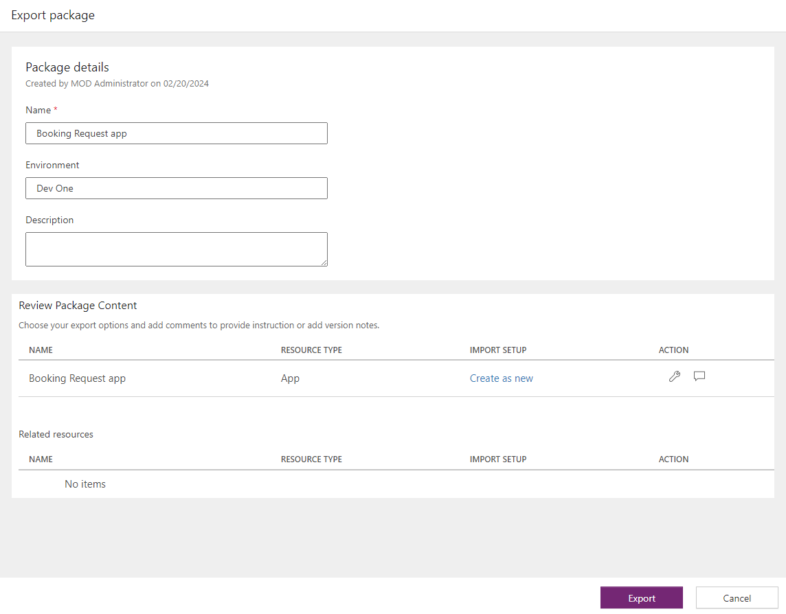

---
lab:
  title: 'Laboratório 7: Gerenciar aplicativos de tela'
  module: 'Module 7: Publish, share, and maintain a canvas app'
---

# Laboratório de prática 7: Gerenciar aplicativos de tela

Neste laboratório, você vai gerenciar seu aplicativo de tela.

## O que você aprenderá

- Como compartilhar aplicativos de tela
- Como gerenciar versões de aplicativos de tela
- Como publicar aplicativos de tela
- Como exportar aplicativos de tela

## Macroetapas do laboratório

- Compartilhar um aplicativo de tela
- Exibir versões do aplicativo de tela
- Publicar um aplicativo de tela
- Exportar um aplicativo de tela
  
## Pré-requisitos

- Precisa ter concluído o **Laboratório 6: Formulários**

## Etapas detalhadas

## Exercício 1: Gerenciamento

### Tarefa 1.1: Compartilhar o aplicativo Solicitação de Reserva

1. Navegue até o portal dos Criadores de Power Apps <https://make.powerapps.com>.

1. Certifique-se de que você esteja no ambiente **Dev One**.

1. Selecione a guia **Aplicativos** no menu esquerdo.

1. Escolha o **aplicativo Solicitação de Reserva**, selecione os Comandos (**…**) e escolha **Compartilhar**.

    

1. No painel Compartilhar, insira `Everyone` e selecione **Todos da Contoso**.

    

1. Selecione **Compartilhar**.

1. **Feche** o painel Compartilhar do aplicativo.

### Tarefa 1.2: Publicar o aplicativo Solicitação de Reserva

1. Escolha o **aplicativo Solicitação de Reserva**, selecione os Comandos (**…**) e escolha **Detalhes**.

1. Selecione a guia **Versões**.

    

1. Selecione a última versão.

    

1. Selecione **Publicar esta versão**.

1. Escolha **Publicar esta versão** novamente.

## Exercício 2: Exportação

### Tarefa 2.1: Exportar o aplicativo Solicitação de Reserva

1. Navegue até o portal dos Criadores de Power Apps <https://make.powerapps.com>.

1. Certifique-se de que você esteja no ambiente **Dev One**.

1. Selecione a guia **Aplicativos** no menu esquerdo.

1. Escolha o **aplicativo Solicitação de Reserva**, selecione os Comandos (**…**) e escolha **Exportar pacote**.

    

1. Insira `Booking Request app` em Nome

1. Selecione **Atualizar** em **IMPORTAR CONFIGURAÇÃO**.

1. Selecione **Criar como novo** e escolha **Salvar**.

1. Selecione **Exportar**.

1. Aguarde até que o pacote seja criado e baixado. Isso criará um arquivo zip na pasta Downloads.

### Tarefa 2.2: Salvar o aplicativo localmente

1. Selecione a guia **Aplicativos** no menu esquerdo.

1. Escolha o **aplicativo Solicitação de Reserva**, selecione os Comandos (**…**) e escolha **Editar > Editar em uma nova guia**.

1. Selecione o cursor suspenso ao lado de **Salvar** no canto superior direito do Power Apps Studio.

1. Escolha **Baixar uma cópia**.

1. Selecione **Baixar**.  Isso criará um arquivo msapp na pasta Downloads.

1. Selecione o botão **<- Voltar** no canto superior esquerdo da barra de comandos e escolha **Sair** para sair do aplicativo.
